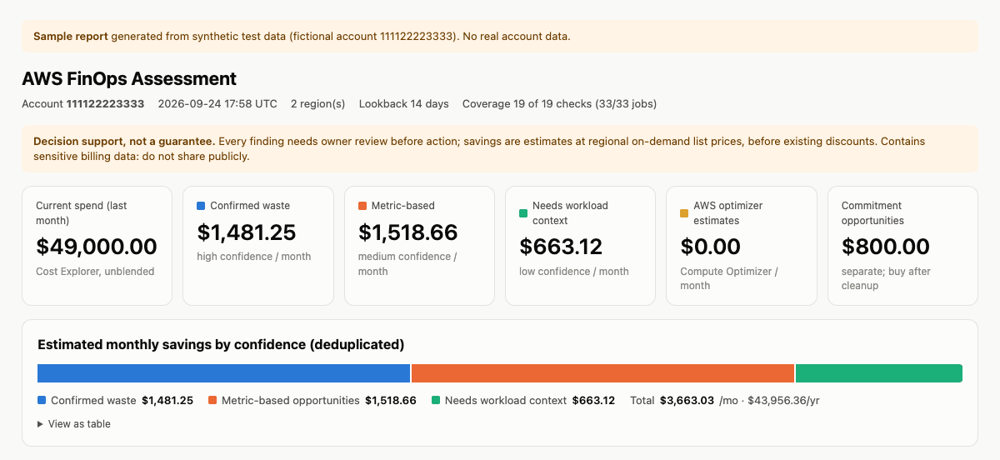
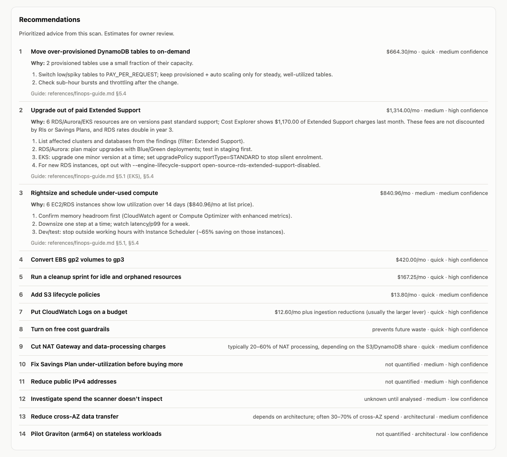
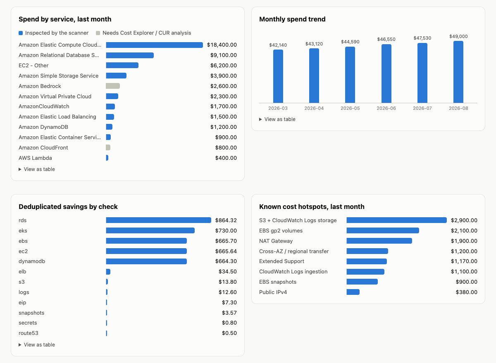
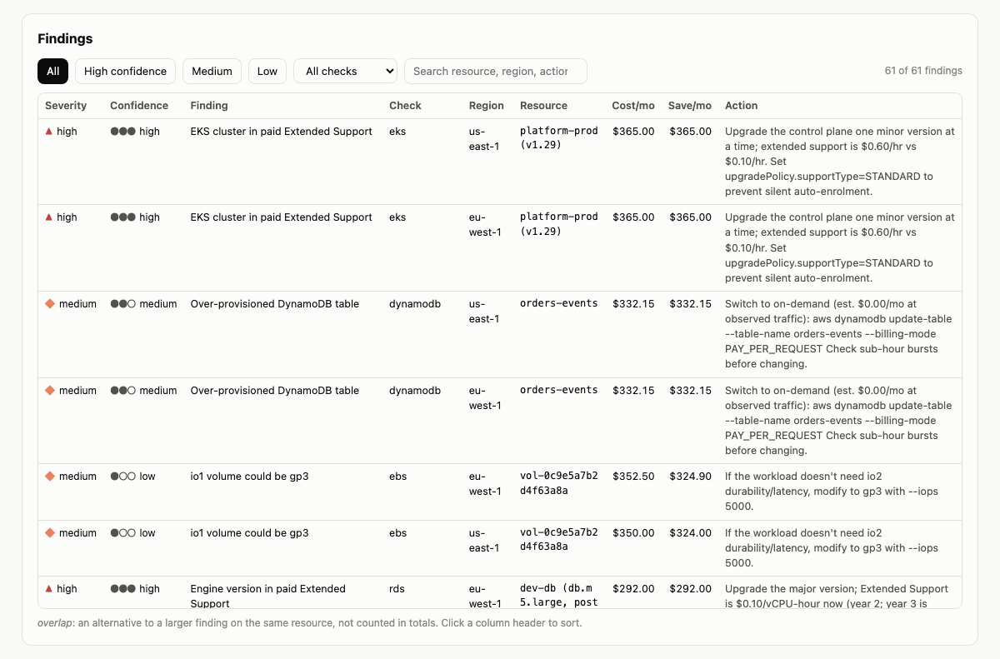
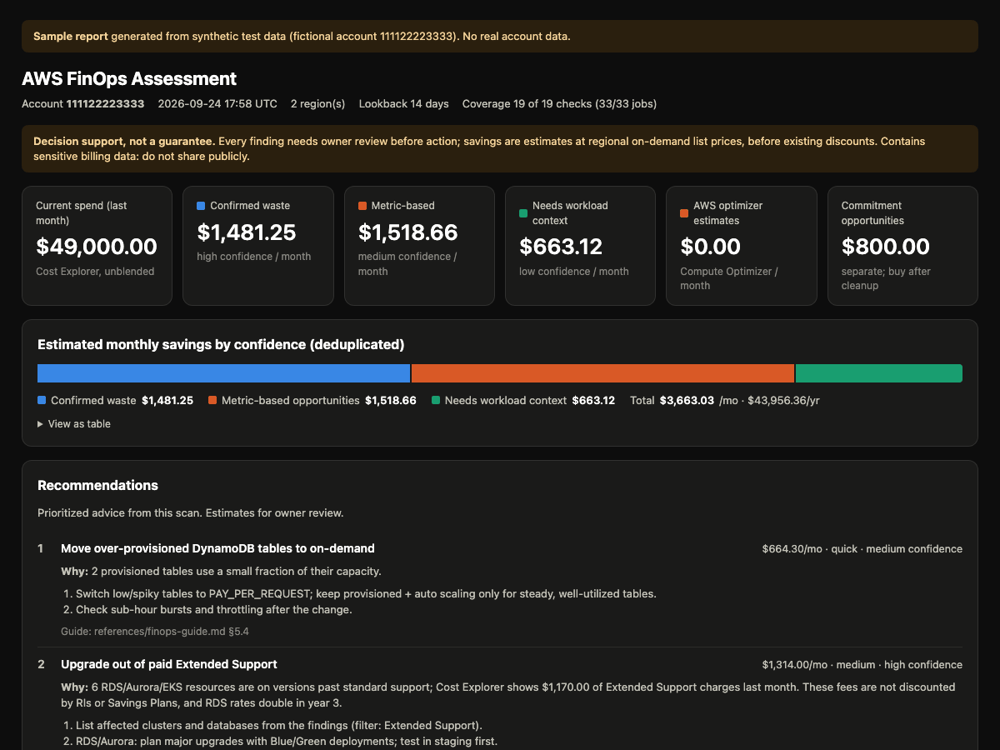

# aws-finops

An agent skill that finds wasted spend in an AWS account and tells you what to do about it.

[](assets/aws-finops-demo.mp4)

*A 22-second demo on synthetic data. [Watch it with sound](assets/aws-finops-demo.mp4).*

You ask your coding agent (Bob,Claude Code, Codex, Cursor, Copilot, Gemini CLI and others) to look at your AWS costs. It runs a read-only scan, writes a report with charts and ranked recommendations, and explains the results. It never changes anything in your account.

## Features

- **Read-only scan.** Uses only Describe, List and Get calls. The included IAM policy has no write permissions.
- **Account guard.** You pass the account ID you expect to scan. If your credentials point at a different account, the scan stops before making any other call.
- **Spend breakdown.** Six months of spend by service, top usage types, spend by account and region, month-over-month changes, and anomalies from Cost Explorer.
- **18 resource checks across all regions:**

  | Area | Checks |
  |---|---|
  | Compute | EC2, Lambda, EKS |
  | Storage | EBS, snapshots and AMIs |
  | Networking | NAT Gateways, load balancers, Elastic IPs and public IPv4 |
  | Databases | RDS and Aurora, DynamoDB, ElastiCache, OpenSearch, Redshift, SageMaker |
  | S3 | Lifecycle rules |
  | Observability and other | CloudWatch Logs, CloudTrail, AWS Config, Secrets Manager, Route 53 |
  | Built-in AWS tools | Compute Optimizer and Cost Optimization Hub results |

- **Recommendations.** A ranked action plan built from your data. Each item says why it applies, what to do, the expected savings, the effort, and how sure it is.
- **Confidence levels.**
  - **High:** directly observed waste, like an unattached volume.
  - **Medium:** based on metrics, like low CPU.
  - **Low:** needs someone who knows the workload, like a move to Graviton.
- **Honest totals.**
  - **Deduplicated:** if two findings are alternatives for the same resource (delete it, or convert it), only the larger saving counts.
  - **Priced for the right region:** prices are looked up live for each resource's region.
  - **Commitment savings kept separate:** Savings Plan recommendations are not added to the cleanup total.
- **Coverage report.** Shows how many checks completed. A scan with failed checks is marked partial and exits with code 2, so nothing silently goes missing.
- **HTML report.** One offline file with charts, a filterable findings table, and light and dark mode. It makes no network requests.
- **Redaction.** `--redact` replaces account IDs, resource names, ARNs, IPs and tags with pseudonyms, so you can share a report or paste it into an AI tool without exposing real names.
- **Scan comparison.** `diff` compares two scans and shows what was fixed, what is new, and what is still open.
- **FinOps guide.** `references/finops-guide.md` has around 40 waste patterns with detection commands, fixes and prices. The agent uses it to answer questions and dig deeper than the scanner.

## What the report looks like

These screenshots come from a synthetic test account, not real data. To try the interactive version, download [`assets/sample-report.html`](assets/sample-report.html) and open it in a browser.

**Summary**



**Recommendations**



**Spend and savings charts**



**Findings table** (filter by confidence or check, search, sort)



**Dark mode**



## Quick start

1. **Check the requirements:** Python 3.9 or newer, [AWS CLI v2](https://docs.aws.amazon.com/cli/latest/userguide/getting-started-install.html), and an agent that supports skills.
2. **Install the skill:**
   ```bash
   npx skills add Shrinidhikulkarni7/aws-finops
   ```
3. **Log in to AWS:**
   ```bash
   aws sso login --profile my-profile        # or however you normally log in
   ```
4. **Ask your agent:**
   > Analyse the AWS costs for my `my-profile` account.

   The agent shows you the account it found and asks you to confirm before scanning.
5. **Open `report.html`** from the `finops-reports/` folder it creates.

## Installation

### Option 1: `npx skills` (recommended)

It detects which agents you have installed and puts the skill in the right place.

```bash
npx skills add Shrinidhikulkarni7/aws-finops                           # choose agents interactively
npx skills add Shrinidhikulkarni7/aws-finops -a claude-code -a cursor  # specific agents
npx skills add Shrinidhikulkarni7/aws-finops -g                        # for all your projects
```

### Option 2: GitHub CLI (version 2.90 or newer)

```bash
gh skill install Shrinidhikulkarni7/aws-finops aws-finops --scope user
```

### Option 3: Copy the folder

The skill is the folder `skills/aws-finops`. Clone the repo and link that folder into your agent's skills directory. Keep the folder name `aws-finops`.

```bash
git clone https://github.com/Shrinidhikulkarni7/aws-finops.git ~/aws-finops

# Codex, Cursor, Copilot, Gemini CLI, Devin, OpenCode, Amp, Goose and Junie all read this folder:
mkdir -p ~/.agents/skills && ln -s ~/aws-finops/skills/aws-finops ~/.agents/skills/aws-finops

# Claude Code (Cline and OpenCode read this one too):
mkdir -p ~/.claude/skills && ln -s ~/aws-finops/skills/aws-finops ~/.claude/skills/aws-finops
```

On Windows, copy the folder instead of linking it.

### Where each agent looks

"Global" makes the skill available in every project. "Project" makes it available only in one repository. Restart the agent after installing.

| Agent | Global folder | Project folder | How to call it |
|---|---|---|---|
| Claude Code | `~/.claude/skills/` | `.claude/skills/` | Automatic, or `/aws-finops` |
| OpenAI Codex | `~/.agents/skills/` | `.agents/skills/` | Automatic, or `$aws-finops` |
| Cursor | `~/.agents/skills/` or `~/.cursor/skills/` | `.agents/skills/` or `.cursor/skills/` | Automatic, or `/` in Agent chat |
| GitHub Copilot | `~/.copilot/skills/` or `~/.agents/skills/` | `.github/skills/` or `.agents/skills/` | Automatic, or `/aws-finops` |
| Gemini CLI | `~/.gemini/skills/` or `~/.agents/skills/` | `.gemini/skills/` or `.agents/skills/` | Automatic |
| IBM Bob | `~/.bob/skills/` | `.bob/skills/` | Automatic (Bob asks permission first) |
| Kiro | `~/.kiro/skills/` | `.kiro/skills/` | Automatic, or `/aws-finops` |
| Cline | `~/.cline/skills/` | `.cline/skills/` or `.claude/skills/` | Automatic, or `/aws-finops` |
| Devin Desktop (formerly Windsurf) | `~/.agents/skills/` | `.devin/skills/` or `.agents/skills/` | Automatic, or `@aws-finops` |
| OpenCode | `~/.config/opencode/skills/` or `~/.agents/skills/` | `.opencode/skills/` or `.agents/skills/` | Automatic |
| Amp | `~/.config/amp/skills/` or `~/.agents/skills/` | `.agents/skills/` | Automatic |
| Goose | `~/.agents/skills/` | `.agents/skills/` | Automatic, or `/skills` |
| JetBrains Junie | `~/.junie/skills/` or `~/.agents/skills/` | `.junie/skills/` or `.agents/skills/` | Automatic, or `/aws-finops` |

Other agents that support the [Agent Skills](https://agentskills.io) format usually read `~/.agents/skills/`.

**Claude.ai and the Claude API** can load the skill as a zip upload. Their sandbox cannot reach your AWS account, though, so there the skill only gives advice or reviews a report you upload. To run scans, use an agent on your own machine.

## AWS access

The scanner uses your normal AWS CLI login: profiles, SSO or environment variables.

For least privilege, create a role or user with the policy in [`skills/aws-finops/references/iam-policy.json`](skills/aws-finops/references/iam-policy.json). It allows exactly the read-only calls the scanner makes.

```bash
aws iam create-policy --policy-name AwsFinopsReadOnly \
  --policy-document file://skills/aws-finops/references/iam-policy.json
```

- **Management (payer) account:** Cost Explorer shows spend for the whole organization. The resource checks only cover the account you scan.
- **Cost of a scan:** Cost Explorer charges $0.01 per API request, and a scan makes about 15 requests (about $0.15). Use `--no-ce` to skip them. All other calls are free.
- **Better results:** turn on Compute Optimizer and Cost Optimization Hub (both free) in your account. The scan picks up their recommendations after about 14 days.

## Using it with an agent

Ask in plain language. For example:

- "Analyse the AWS costs for my `prod-readonly` profile."
- "Why did our AWS bill go up last month?"
- "Find idle resources in us-east-1 and eu-west-1."
- "Are we using our Savings Plans well?"
- "Compare this month's scan with last month's."
- "Should we switch our Aurora cluster to I/O-Optimized?" (answered from the guide, without scanning)

The agent will:

1. Check that Python and the AWS CLI are installed.
2. Show you the account and ask you to confirm it.
3. Run the scan.
4. Explain the results, starting with the recommendations.
5. Write a `savings-plan.md` with the exact commands to run.

It never runs a command that changes your account unless you approve that specific command.

## Running the scanner yourself

You don't need an agent to use the scanner.

```bash
# 1. Find your account ID
aws sts get-caller-identity --profile my-profile

# 2. Scan it
python3 skills/aws-finops/scripts/finops_scan.py --expected-account-id 123456789012 --profile my-profile

# A quick, free test: one region, no Cost Explorer
python3 skills/aws-finops/scripts/finops_scan.py --expected-account-id 123456789012 --profile my-profile \
  --regions us-east-1 --no-ce
```

Results go to `finops-reports/<account>-<time>/`:

| File | Contents |
|---|---|
| `report.html` | Visual report to open in a browser |
| `report.md` | Text version (this is what the agent reads) |
| `findings.json` | Full data for scripts and for `diff` |

Only you can read these files: the folder is created with permissions 0700 and the files 0600. The folder is in `.gitignore`.

### Options

| Option | Default | What it does |
|---|---|---|
| `--expected-account-id` | required | The 12-digit account you mean to scan. The scan stops if your credentials belong to another account |
| `--profile` | AWS CLI default | AWS CLI profile to use |
| `--regions` | all enabled regions | Comma-separated list of regions |
| `--checks`, `--skip` | all | Run or skip specific checks: `ebs`, `ec2`, `eip`, `snapshots`, `elb`, `nat`, `rds`, `logs`, `lambda`, `eks`, `dynamodb`, `managed`, `secrets`, `config`, `s3`, `cloudtrail`, `route53`, `optimizers`, `ce` |
| `--no-ce` | off | Skip Cost Explorer (the only paid calls) |
| `--lookback-days` | 14 | How many days of metrics to use for utilization |
| `--snapshot-age-days` | 90 | Age at which a snapshot counts as old |
| `--out` | `finops-reports/...` | Output folder |
| `--allow-partial` | off | Exit with 0 even if some checks failed |
| `--redact` | off | Hide identifiers in all outputs (see [Sharing reports safely](#sharing-reports-safely)) |
| `--redact-key-file` | new key each run | Reuse a key so redacted names stay the same between scans |
| `--redaction-map` | off | Write a private file that maps pseudonyms back to real names |
| `--workers` | 12 | How many checks run in parallel |

### Exit codes

| Code | Meaning |
|---|---|
| 0 | Scan complete |
| 2 | Partial scan: some checks failed, usually because of missing permissions. The report lists them |
| 3 | The account doesn't match `--expected-account-id`, or the partition isn't supported. Nothing was scanned |
| 4 | Not logged in, or the AWS CLI isn't installed |

## Reading the report

The report starts with a summary:

| Line | Meaning |
|---|---|
| Current spend | Last full month, from Cost Explorer |
| Spend in services the scanner inspects | How much of the bill the checks cover. The rest is listed under "Needs deeper analysis" |
| Confirmed waste | High-confidence savings |
| Metric-based opportunities | Medium-confidence savings. Confirm with the resource owner |
| Needs workload context | Low-confidence savings. Treat these as ideas to discuss |
| AWS optimizer estimates | Figures from Compute Optimizer |
| Commitment opportunities | Savings Plan suggestions. Buy these after cleanup; they are not added to the other totals |

Some things to keep in mind:

- **Estimates:** savings use on-demand list prices and don't include discounts you already get (Savings Plans, RIs, enterprise agreements).
- **Price lookups:** if one fails, the scanner uses a built-in us-east-1 price and says so under Warnings.
- **Snapshots:** snapshot costs are upper bounds, because snapshots only store changed blocks.
- **Overlaps:** a row marked *overlap* is an alternative to a larger finding on the same resource, and isn't counted in the totals.
- **Next steps:** every finding needs a check by someone who knows the resource before anything is deleted.

## Sharing reports safely

```bash
python3 skills/aws-finops/scripts/finops_scan.py --expected-account-id 123456789012 --profile my-profile \
  --redact --redact-key-file ~/.aws-finops.key
```

With `--redact`:

- **Replaced:** account IDs, resource IDs and names, ARNs, IP addresses, email addresses and tag values become pseudonyms like `vol-3fa9c2e1b0`.
- **Kept:** regions, services, instance types, sizes, costs and metrics.

The key file controls the pseudonyms:

- **With the same key file:** each resource gets the same pseudonym in every scan, so you can compare redacted scans.
- **Without a key file:** each scan uses a new random key, and scans can't be linked to each other.
- **Mapping back:** `--redaction-map ~/aws-finops-map.json` writes a private file that maps pseudonyms back to real names. Keep it to yourself.

## Comparing scans

After you fix things, scan again and compare:

```bash
python3 skills/aws-finops/scripts/finops_scan.py diff \
  finops-reports/<old-scan>/findings.json finops-reports/<new-scan>/findings.json
```

This writes `diff.md` and `diff.json`:

| Section | Meaning |
|---|---|
| Resolved | Findings that are gone, with the estimated monthly savings |
| New | Findings that weren't in the old scan |
| Still open | Findings in both scans |
| Not re-assessed | Findings that are gone because their check failed in the new scan. These are not counted as fixed |

Findings are matched by a stable ID, so renaming a resource or a change in cost doesn't confuse the comparison. The command refuses to compare two different accounts.

## Safety

- **Read-only.** The scanner can't change anything, and the skill tells the agent never to run a change without your approval.
- **Right account.** The account guard stops the scan if your credentials point somewhere else.
- **Resource names are treated as data.** Names and tags from AWS are escaped in the reports, and the agent is told never to follow instructions found in them.
- **Private reports.** Report files are readable only by you and are gitignored. Use `--redact` before sharing.
- **Known cost.** About $0.15 per scan for Cost Explorer, or nothing with `--no-ce`.
- **Supported partition.** Commercial AWS only. GovCloud and China are refused.

## Troubleshooting

| Problem | Fix |
|---|---|
| The agent doesn't use the skill | Check that the folder is named `aws-finops` and contains `SKILL.md`, restart the agent, or call it directly (`/aws-finops`) |
| Exit code 3, "Account guard" | Your credentials point at a different account. Check `--profile` or `AWS_PROFILE` |
| Exit code 4 | Run `aws sso login --profile ...`, or install AWS CLI v2 |
| Exit code 2, "PARTIAL SCAN" | Some permissions are missing. Attach `iam-policy.json`, or pass `--allow-partial` |
| "Compute Optimizer not active" | Turn it on (free) and scan again after about 14 days |
| "Database Savings Plan recommendation unavailable" | Update the AWS CLI |
| Slow on a big account | Use `--regions`, `--checks` or a higher `--workers` |
| `python3` not found on Windows | Use `python` or `py -3` |

## Updating and removing

- **Update:** `npx skills update`, or `git pull` if you linked the folder.
- **Remove:** `npx skills remove aws-finops`, or delete the `aws-finops` folder from your agent's skills directory.

## Development

```
skills/aws-finops/
├── SKILL.md                     instructions for the agent
├── references/finops-guide.md   FinOps knowledge base
├── references/iam-policy.json   read-only IAM policy
└── scripts/finops_scan.py       the scanner (Python standard library only)
tests/                           tests and a fake AWS CLI (not part of the skill)
assets/                          README images, demo video and the sample report
```

Run the tests (no AWS account needed):

```bash
python3 -m unittest discover -s tests -t tests -v
```

The tests run the scanner against a fake AWS CLI. They also check that every field the scanner reads exists in the AWS CLI's own API definitions, and that the IAM policy matches the calls the scanner makes.

## License

[MIT](LICENSE)
